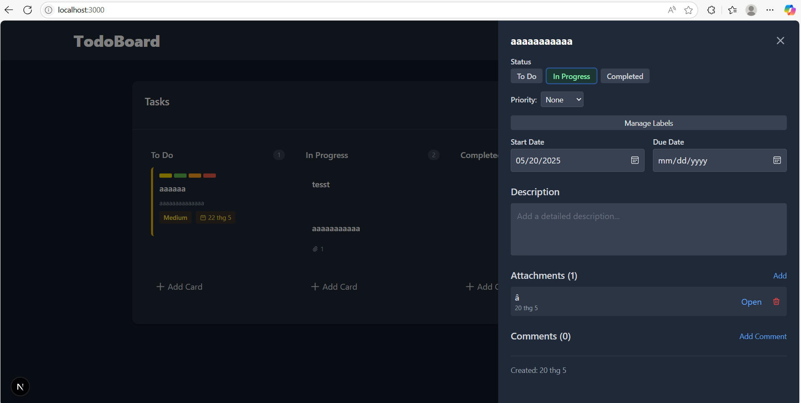

# Todo app

Demo



## Features

- Drag-and-drop cards between lists
- Detailed cards with comments, attachments, and checklists
- Priority levels, due dates, and custom labels
- Progress tracking with visual indicators
- Dark/light mode support
- Data persistence with localStorage

## Tech Stack

- **Next.js** - React framework
- **Redux Toolkit** - State management

## Setup

```bash
# Install dependencies
npm install

# Run development server
npm run dev
```
